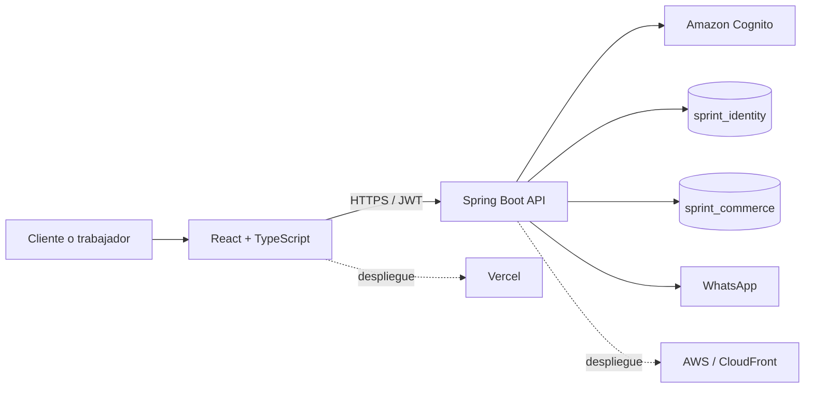

# Sprint | Plataforma de comercio electrónico

[](https://github.com/matezepam/app-shopping-clothes/actions/workflows/ci.yml)
[](https://sprint-clothes-ecuador.vercel.app)
[](LICENSE)

Sprint es una plataforma web para administrar el ciclo comercial de una tienda de ropa: catálogo, inventario, pedidos, proveedores, moderación, devoluciones, usuarios y reportes. El proyecto separa la identidad, la lógica de negocio y la persistencia para mantener controles de acceso claros y operaciones trazables.

## Entorno publicado

| Componente | Dirección | Estado esperado |
| --- | --- | --- |
| Aplicación web | [sprint-clothes-ecuador.vercel.app](https://sprint-clothes-ecuador.vercel.app) | Interfaz pública y paneles por rol |
| API | [d2q9niwakr7mc.cloudfront.net](https://d2q9niwakr7mc.cloudfront.net/actuator/health) | Respuesta de salud `UP` |

El frontend se publica en Vercel y consume la API alojada en AWS. PostgreSQL y los servicios internos no se exponen directamente a Internet.

## Funciones principales

- Catálogo con categorías, variantes, existencias y galería de imágenes.
- Registro, confirmación e inicio de sesión mediante Amazon Cognito.
- Carrito, solicitud de compra, reserva de inventario y contacto por WhatsApp.
- Seguimiento de pedidos con historial de estados.
- Solicitudes de devolución y reintegro controlado de existencias.
- Creación y edición de productos con carga validada de imágenes.
- Moderación de publicaciones con decisión, motivo, responsable y fecha.
- Gestión de proveedores, inventario, usuarios y reportes administrativos.
- Auditoría de operaciones con actor, rol, ruta, resultado y código HTTP.

## Roles de acceso

| Rol | Responsabilidades principales |
| --- | --- |
| Cliente (`USER`) | Consultar el catálogo, administrar favoritos y carrito, realizar solicitudes, consultar pedidos y solicitar devoluciones. |
| Vendedor (`VENDOR`) | Registrar productos, administrar existencias, revisar pedidos y gestionar proveedores. |
| Moderador (`MODERATOR`) | Revisar productos pendientes, aprobarlos, observarlos o rechazarlos y dejar constancia de la decisión. |
| Administrador (`ADMIN`) | Supervisar usuarios, catálogo, inventario, pedidos, devoluciones, reportes y auditoría. |

Los permisos se validan en el backend. La interfaz oculta acciones no autorizadas, pero no sustituye el control de acceso del servidor.

## Arquitectura



- **Frontend:** React 19, TypeScript, Vite, Tailwind CSS e i18next.
- **Backend:** Kotlin, Spring Boot 3, Spring Security, OAuth2 Resource Server y JPA.
- **Identidad:** Amazon Cognito para registro, confirmación, tokens y grupos.
- **Datos:** PostgreSQL 16 con bases separadas para identidad y operación comercial.
- **Infraestructura:** Docker Compose para desarrollo; Vercel y AWS para publicación.

## Estructura del repositorio

```text
app-shopping-clothes/
|-- .github/             Integración continua y actualizaciones controladas
|-- backend/             API, seguridad, reglas de negocio y migraciones Flyway
|-- frontend/            Aplicación React y recursos del catálogo
|-- infra/               Plantillas de AWS, PostgreSQL y pgAdmin
|-- runtime/             Archivos generados durante la ejecución local
|-- scripts/             Inicio, pruebas, respaldo y restauración
|-- compose.yaml         Servicios del entorno local
|-- .env.example         Plantilla de configuración sin secretos
`-- README.md            Documentación principal
```

Las capturas, diagramas, respaldos históricos y documentos académicos se conservan fuera del repositorio.

## Ejecución local

### Requisitos

- Docker Desktop con Docker Compose.
- PowerShell 7 o Windows PowerShell.
- Puertos `8088` y `5050` disponibles.

### Inicio completo

1. Copiar `.env.example` como `.env` y completar únicamente las variables locales requeridas.
2. Iniciar la plataforma:

```powershell
.\scripts\docker-up.ps1 -OpenBrowser
```

3. Verificar los servicios:

```powershell
.\scripts\smoke-test.ps1
```

La tienda queda disponible en `http://localhost:8088` y pgAdmin en `http://localhost:5050`. Para detener los contenedores sin eliminar los datos:

```powershell
.\scripts\docker-down.ps1
```

## Configuración

Los secretos se almacenan en el entorno de ejecución y nunca en Git. Las variables principales son:

```text
IDENTITY_DATASOURCE_URL=jdbc:postgresql://.../sprint_identity?sslmode=require
COMMERCE_DATASOURCE_URL=jdbc:postgresql://.../sprint_commerce?sslmode=require
DATABASE_USERNAME=...
DATABASE_PASSWORD=...
APP_CORS_ALLOWED_ORIGINS=https://sprint-clothes-ecuador.vercel.app
APP_WHATSAPP_BUSINESS_NUMBER=593939051525
AWS_COGNITO_REGION=us-east-1
AWS_COGNITO_USER_POOL_ID=...
AWS_COGNITO_CLIENT_ID=...
AWS_COGNITO_CLIENT_SECRET=...
VITE_API_URL=https://d2q9niwakr7mc.cloudfront.net
```

Amazon Cognito asigna `USER` a los registros públicos. Los grupos administrativos se gestionan fuera del formulario de registro para evitar elevación de privilegios.

## Pruebas y control de calidad

Backend:

```powershell
cd backend
.\gradlew.bat clean test bootJar --no-daemon
```

Frontend:

```powershell
cd frontend
npm ci
npm audit --audit-level=high
npm run build
```

Contenedores:

```powershell
docker compose config --quiet
docker build --target runtime -t sprint-backend ./backend
docker build --target runtime -t sprint-frontend ./frontend
```

GitHub Actions repite estas verificaciones en cada pull request. La rama `main` exige que backend, frontend y contenedores finalicen correctamente antes de integrar cambios.

## Persistencia y seguridad

- Las contraseñas pertenecen exclusivamente a Cognito; PostgreSQL no las almacena.
- Los tokens se validan por emisor, audiencia, expiración y tipo.
- Las respuestas `401` y `403` diferencian autenticación y autorización.
- Los movimientos de inventario conservan trazabilidad y evitan saldos negativos.
- Las solicitudes de compra utilizan claves de idempotencia.
- Las imágenes se validan por tipo, firma, tamaño y cantidad antes de guardarse.
- Nginx y Vercel aplican encabezados de seguridad; CORS limita los orígenes permitidos.
- Los respaldos se generan y verifican mediante los scripts incluidos.

## Publicación

El proyecto de Vercel debe usar `frontend` como directorio raíz, `npm run build` como comando de construcción y `dist` como directorio de salida. `frontend/vercel.json` mantiene las rutas internas de la SPA y aplica encabezados de seguridad.

La integración entre GitHub y Vercel genera una vista previa por pull request. Al integrar un cambio aprobado en `main`, Vercel publica automáticamente la nueva versión del frontend. El backend se despliega de forma independiente en AWS para conservar la base de datos y los archivos persistentes.

## Licencia

Este proyecto se distribuye bajo la licencia MIT incluida en [LICENSE](LICENSE).
